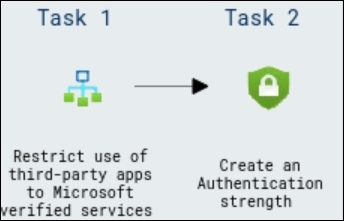
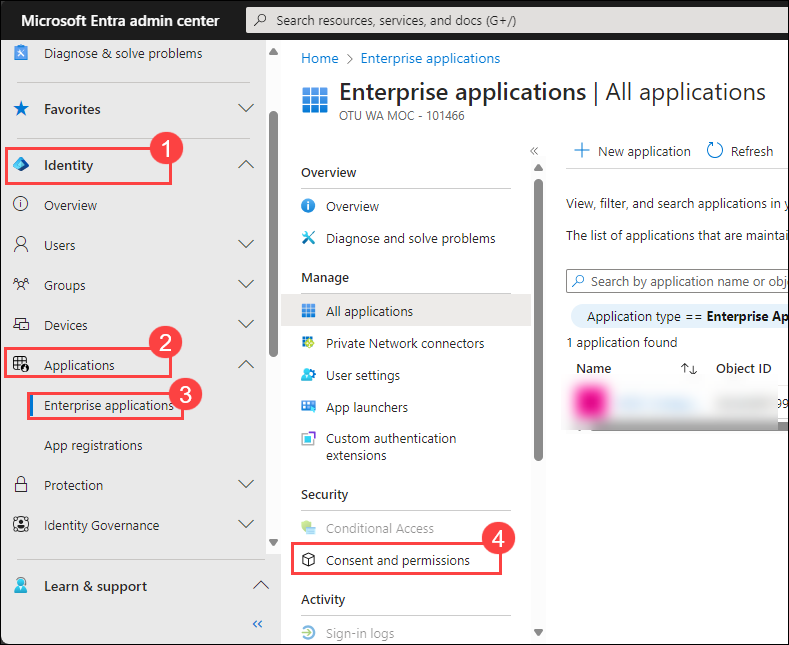
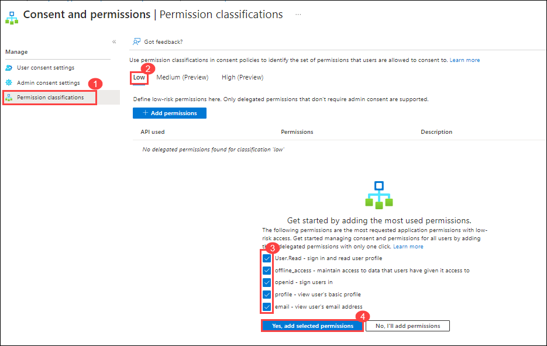
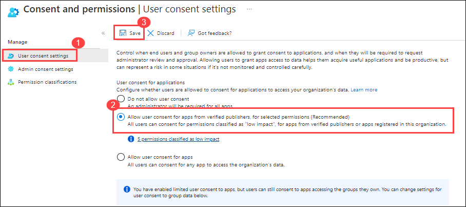
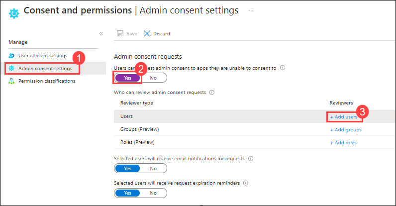
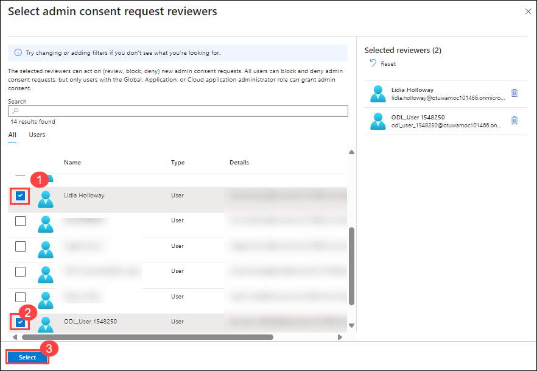
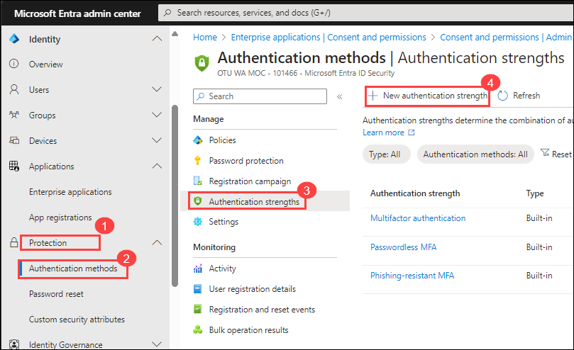
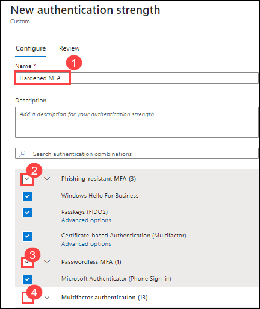
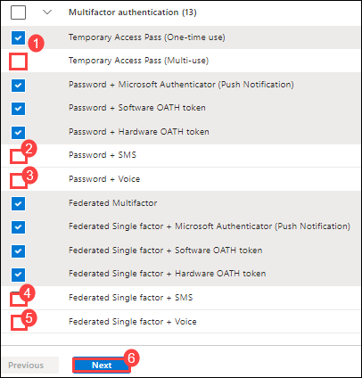
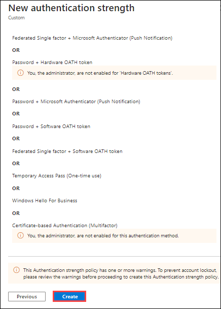

# Excercise-1: Configure Entra ID

You are the newly promoted IT-Security specialist of Contoso Ltd. As the company recently acquired Tailwind Traders, you reviewed your Entra ID tenant and decided on new security requirements. Your task is to manage the tasks and implement policies to meet the requirements that come with the acquisition.

You reviewed enterprise applications and noted that some users have provided permissions for a third-party application to access their mailbox data. This is a potential risk for data loss from email correspondence. Therefore, you wish to restrict this behavior but allow users to sign-in and share login IDs to websites Microsoft has validated. You also want to allow users to request specific access to new SaaS products using their Entra ID identity. 

Since a partner organization was recently attacked using SMS interception, you want to enforce authentication assurance following NIST. To achieve this, you will create an Authentication strength policy to deactivate SMS OTP and restrict the use of AAL1 authentication methods in your organization. You will create this configuration in the Entra ID portal.

## Estimated Duration: 

## Architecture Diagram

   

## Explanation of Components

  The architecture for this lab involves the following key components:  

  - **Microsoft Verified Services**: Restricts the use of third-party applications, ensuring only trusted, Microsoft-verified services are utilized for enhanced security.  

   - **Authentication Strength**: Establishes customized authentication policies to enforce stronger and more secure access controls for sensitive resources.  

## Part 1: Design a solution

In this task you will design a concept to address the risks Contoso Ltd. is facing.

### Design approach

The initial step involves analyzing the requirements based on the described issue, understanding the objectives and defining the requirements.

Based on the provided use-case, the following requirements can be outlined:

- Restrict uncontrolled access from third-party applications
- Allow users to share login IDs to validated services
- Allow users to request access to SaaS products
- Improve on authentication strength

In the second step examine Contoso Ltd.'s existing environment. Microsoft Entra ID offers solutions to manage and restrict user's and cloud application's access with the use of Entra ID policies. Investigate which controls exist and which policies are already in place. Use the Entra ID portal to review current configurations and policies and determine if adjustments are necessary or if new policies need to be implemented.

The third phase involves crafting the solution's concept. Upon investigation, it is evident that none of the current policies meet the defined requirements. Therefore, adjustments to the Entra ID configuration are essential.

### Proposed solution

|Requirement|Solution|Action plan|
|----|----|----|
|Block uncontrolled access from third-party applications|Entra ID application policy|Restrict user consent to permissions classified as "low impact", for apps from verified publishers or apps registered in this organization|
|Allow users to share login IDs to validated services|Entra ID application policy|Restrict user consent to permissions classified as "low impact", for apps from verified publishers or apps registered in this organization|
|Allow users to request access to SaaS products|Entra ID application policy|Define users that are eligible to approve of applications that are safe to use|
|Restrict use of insecure authentication methods|Entra ID authentication methods|Create an authentication strength excluding SMS and Voice methods|

## Part 2: Implement the solution 

**Note:** These lab steps must be executed on the M365 Lab Profile.

### Task 1 - Restrict use of third-party apps to Microsoft verified services

In this task you will restrict the level of access a user can grant to applications. You will also add the functionality for users to request access they are not able to permit themselves. 

1. Open a new tab in **Microsoft Edge**, select the address bar, navigate to **`https://entra.microsoft.com`** and log into the Entra ID Portal with the below credentials if prompted.

    - **Email/Username:** <inject key="AzureAdUserEmail"></inject>
    - **Password:** <inject key="AzureAdUserPassword"></inject>

1. On the left navigation pane, navigate to **Identity** > **Applications** > **Enterprise applications** > **Security** > **Consent and permissions**.

   

1. Navigate to **Permission classifications**.

1. Entra will suggest the most used permissions for **low risk** permissions.

1. Check all these permissions and select **Yes, add selected permissions** to classify them as **low risk** in your Entra ID tenant.

   

1. Navigate to **User consent settings**.

1. Under **User consent for applications** select the recommended option **Allow user consent for apps from verified publishers, for selected permissions**. This enables users to consent for permissions classified as "low impact" (that you previously selected), for apps from verified publishers.

1. Select **Save**.

   

1. Navigate to **Admin consent settings** and enable Admin consent requests by selecting **Yes**, to allows users to request admin consent to apps they are unable to consent to.

   

1. Select **+ Add users** to add **`Lidia Holloway`** and **ODL_User <inject key="DeploymentID" enableCopy="false"/>** as users that can review admin consent requests.

   

1. Select **Save** on the **Admin consent settings** window.

   

1. Keep this browser tab open for the next task.

You have now configured the application consent settings limiting the access every user can grant to applications. Users can still request permission consent to applications and the application admin team can approve of them after evaluating the need and risk for the specific application.

### Task 2 - Create an Authentication strength

In this Task you will use the Entra ID portal to create an own Authentication strength to restrict the use of SMS OTP within your organization. 

1. On the left navigation pane, navigate to **Protection** > **Authentication methods** > **Authentication strengths**.

   

1. Select **+ New authentication strength**.

1. Enter the name **Hardened MFA**.

1. Check **Phishing-resistant MFA**, **Passwordless MFA** and **Multifactor authentication**.

   

1. Under Multifactor authentication uncheck the following:
   - **Temporary Access Pass (Multi-use)**
   - **Password + SMS**
   - **Password + Voice**
   - **Federated Single factor + SMS**
   - **Federated Single factor + Voice**.

     

1. Select **Next**.

1. Review and check, that none of the above factors are left in the authentication strength.

1. Select **Create**.

    

You have now created an authentication strength that restricts the use of SMS OTP as an authentication factor.
