# Conditional Access

You have discovered that employees are accessing Microsoft 365 from unknown locations, despite your Conditional Access policies only allowing access from specific locations and devices. Your investigation has revealed that these employees are accessing Microsoft 365 while traveling home from their office on public transportation. This behavior is in violation of industry regulations, and you want to use Continuous Access Evaluation to prevent it. Additionally, you want to implement the authentication strength you prepared in the previous exercise to secure certain applications that handle customer data. 

## Part 1: Design a solution (required)

In this task you will design a concept to address the risks Contoso Ltd. is facing.

### Design approach

The initial step involves analyzing the requirements based on the described issue, understanding the objectives and defining the requirements.

Based on the provided use-case, the following requirements can be outlined:

- Restrict access from insecure/unknown locations
- Require strong authentication for apps containing sensitive information

In the second step examine Contoso Ltd.'s existing environment. Microsoft Entra ID offers solutions to manage and restrict user access with the use of Entra ID Conditional access policies. Investigate which controls exist and which policies are already in place. Use the Entra ID portal to review current configurations and policies and determine if adjustments are necessary or if new policies need to be implemented.

The third phase involves crafting the solution's concept. Upon investigation, it is evident that there is no trusted network yet configured and none of the current policies meet the defined requirements. Therefore, a new set of Conditional access policies is essential. 

### Proposed solution

|Requirement|Solution|Action plan|
|----|----|----|
|Restrict access from insecure/unknown locations|Entra ID Conditional access policy|Define the current company's networks as trusted network and restrict access to devices inside this network|
|Require strong authentication for apps containing sensitive information|Entra ID Conditional access policy|Create a new conditional access policy scoped to sensitive applications requiring the just created hardened authentication strength that excludes insecure authentication methods like SMS and Voice|

## Part 2: Implement the solution (optional)

### Task 1 - Create trusted network

In this task you will create a named location using your VM's external IP address to define a trusted network you can use in a conditional access policy in the following tasks. You will use this address because your machine is located within your company network.

1. In LabVM, Open a **PowerShell** window with administrator access

1. Enter the following cmdlet to check your current external IP address:

    ```powershell
    (Invoke-RestMethod -Uri http://ifconfig.me).Trim()
    ```
   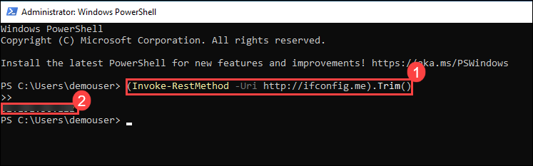

1. Note down the IP address powershell returned.

1. Open **Microsoft Edge**, select the address bar, navigate to **`https://entra.microsoft.com`** and sign in with below credentials if prompted

    - **Email/Username:** <inject key="AzureAdUserEmail"></inject>
    - **Password:** <inject key="AzureAdUserPassword"></inject>

1. On the Stay signed in? dialog box, select the **Don’t show this again** checkbox and then select **No**.

1. Close the password save dialog box by selecting **Not now**, to not save the default global admin's credentials in your browser.

1. On the left navigation pane, navigate to **Protection** > **Conditional Access** > **Named locations**.

   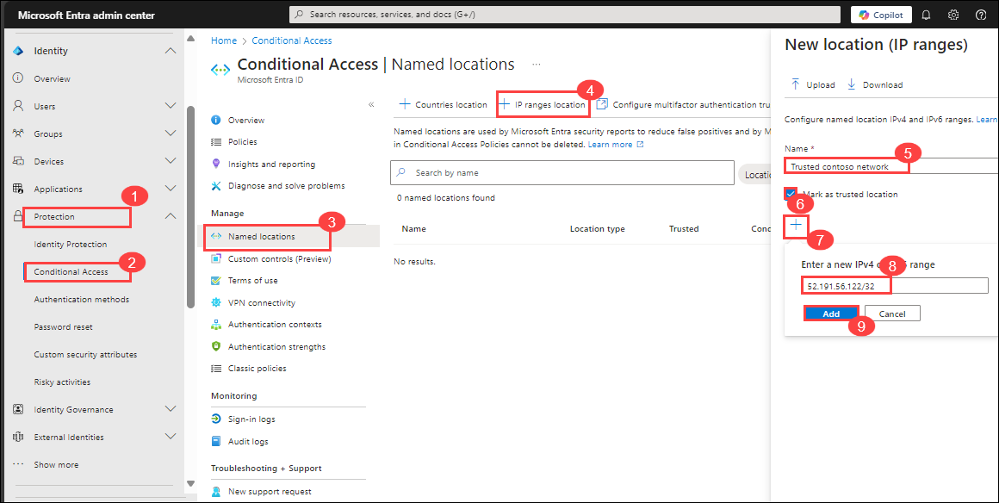

1. Select **+ IP ranges location**.

1. Enter the name **Trusted contoso network**.

1. Select **Mark as trusted location**.

1. Select **+** to add the IP address you noted in **Step 4.**

1. The Input should look like ``**.***.**.***/32`` (*** replace with ip address noted in the above step ).

1. Select **Add**.

1. Select **Create**.

   

You have now defined your Company's external IP Address named and trusted location you can use to restrict access outside the company's network.

### Task 2 - Create new Conditional Access Policy with limited scope

As you have successfully created a trusted network you will now use this to create the Conditional Access policy to restrict access outside the corporate network with a scope limited to your personal user to be able to test and prevent a company wide account lockout from Entra ID.

1. You should still be logged into the Entra ID portal **https://entra.microsoft.com**.

2. On the left navigation pane, navigate to **Protection** > **Conditional Access** > **Policies**.

3. Select **+ New policy**.

   

4. Enter the name **Block access outside Trusted Network**.

   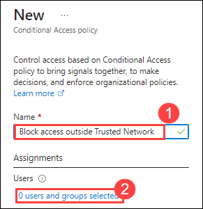

5. Select **0 users and groups selected**.

6. Under **Include** select **Select users and groups** and tick **Users and groups**.

   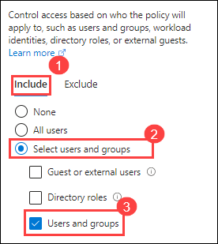

7. Select **Allan Deyoung** as the sole test user for the policy.

   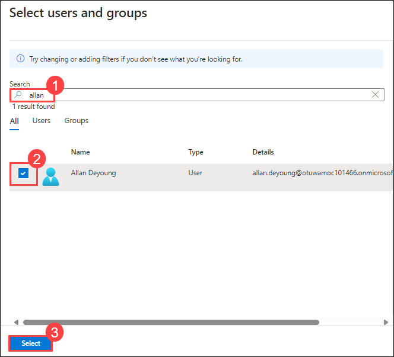

8. Select **No target resources selected** and under **Include** select **All resources (formerly All cloud apps)**.

   

9. Select **0 conditions selected** and under **Locations** select **Not configured**.

   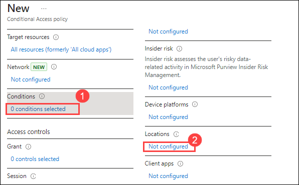

10. Select **Yes** to configure the location condition.

11. Under **Include** select **Any network or location**.

   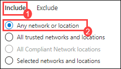

12. Under **Exclude** select **All trusted networks and locations**.

   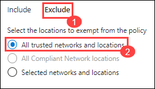

13. Under **Grant** select **0 controls selected** and switch it from **Grant access** to **Block access** then choose **Select** at the bottom of the page.

   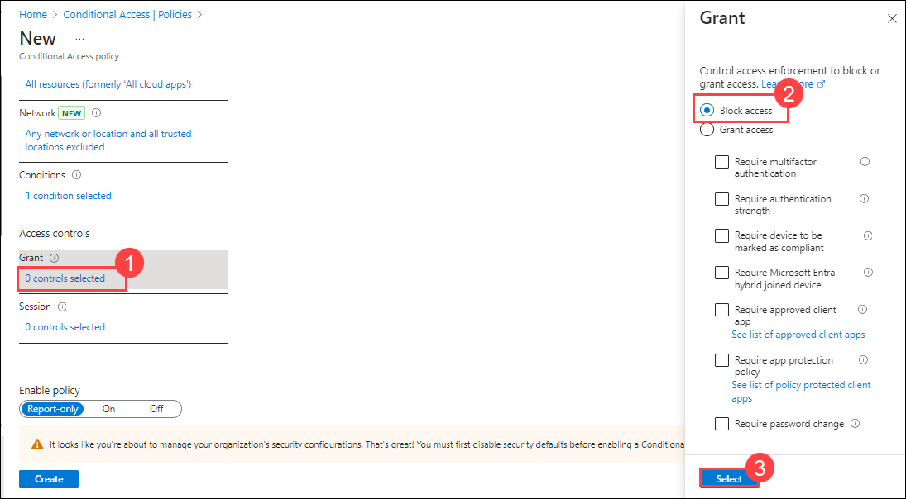

14. Under **Session** select **0 controls selected**.

15. Enable **Customize continuous access evaluation** and select **Strictly enforce location policies (preview)** and choose **Select** at the bottom to confirm.

   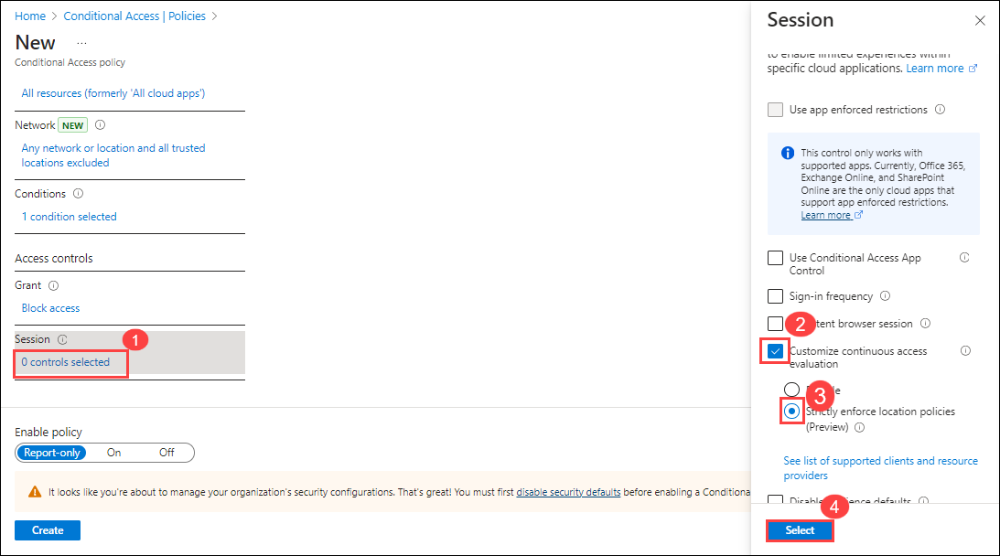

16. Where it says **Enable Policy**, select **On**, then select **Create**.

   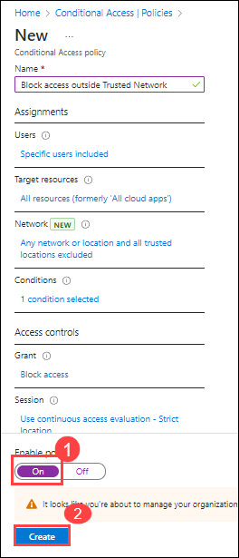

You have now created and enabled your CA policy to restrict access outside trusted networks only affecting your own test user account.

### Task 3 - Test the configured Policy

Since you have created a Conditional Access policy limiting access to all cloud applications of your company you must make sure that access is still possible.

>[!ALERT] This task is significantly abbreviated for illustrative purposes!
In a real world scenario you would do a longer testing period with a larger, more representative group to make sure that no unforeseeable incidents distort the result.

1. Open a new **InPrivate** window in your **Microsoft Edge** browser by selecting its task bar icon with your right mouse button and then select **New InPrivate window**.

1. Select the address bar, navigate to **`https://portal.microsoft.com`** and log into the M365 Portal as **Allan Deyoung** using below credentials

  - Email : <inject key="User 02 UPN" enableCopy="true"/>
  - Password : <inject key="User 02 Password" enableCopy="true"/>

1. On the Stay signed in? dialog box, select the **Don’t show this again** checkbox and then select **No**.

1. Since the login was successful, you can close the **InPrivate** window.

1. Switch back to your Edge browser window where you should still be logged into the Entra ID portal **https://entra.microsoft.com**.

1. On the left navigation pane, navigate to **Protection** > **Conditional Access** > **Monitoring** > **Sign-in logs**.

   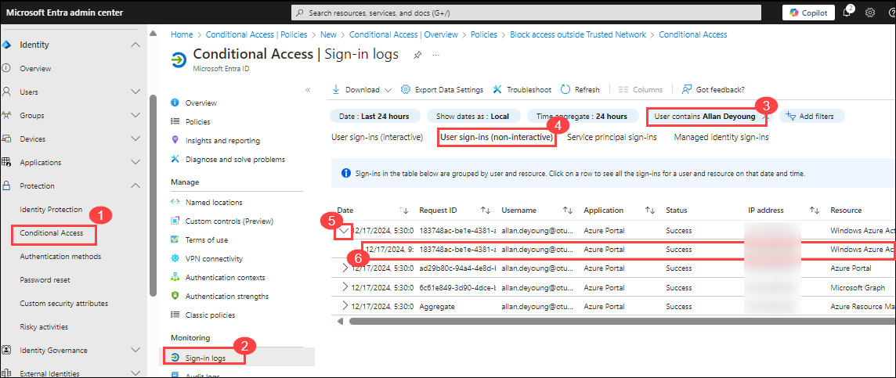

1. Select **Add filters** and filter by the **User** of **Allan Deyoung**.

1. Select the latest log entry of **Allan Deyoung**.

1. Under the **Conditional Access** tab, select **Block access outside Trusted Network**.

   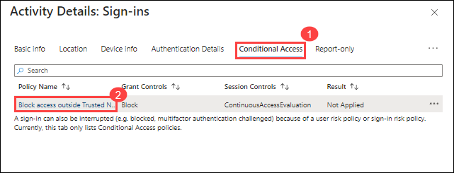

1. Select the **User** assignment and you should see, that it **Matched** by **Direct assignment**.

1. Select the **Application** assignment and you should see, that it **Matched** by **All apps included**.

1. You should also see, that the **Location** condition was **Not matched** since it is within the trusted network that is excluded.

   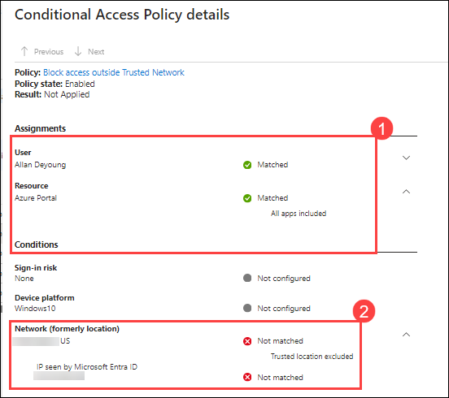

1. If you tried to log in from a network with a different external IP address, this condition would match and block the login attempt.

1. Close the **Conditional Access Policy details** and the **Activity Details: Sign-ins**.

You have now successfully tested and ensured access to all cloud applications from within the company's network. You have also checked the Sign-in logs, to ensure, that the policy works as intended and uses the correct assignments and conditions to restrict access to your cloud applications from outside the company's network.

### Task 4 - Company-wide policy rollout

After the successful test in the previous task, you can now enable the policy for the entire company. To do this you will edit the user scope of the existing policy.

>[!ALERT] The actions implemented in this task can lead to Account lockout!
Make sure, that you have at least one emergency admin account that is excluded from this policy in a productive, real world scenario. 

1. You should still be logged into the Entra ID portal **https://entra.microsoft.com**.
2. On the left navigation pane, navigate to **Protection** > **Conditional Access** > **Policies**.
3. Select the policy **Block access outside Trusted Network**.
4. Under Users select **Specific users included**.
5. Select **All users**.
6. In the warning that appeared on the bottom of the window select **Exclude current user, admin@WWLxZZZZZZ.onmicrosoft.com, from this policy**.
7. Select **Save**.

You have now configured an active working Conditional Access policy that prevents users from logging in outside the trusted network you defined as the company's external IP address. This was tested using a limited user scope to ensure that all cloud applications remain accessible. Lastly you have rolled out the CA policy to all users.

You have successfully restricted access from outside the trusted network.

### Task 5 - Require MFA for Salesforce

In this Task you create a CA policy to enforce the authentication strenth you created in the previous exercise when signing into Salesforce. 

>[!IMPORTANT] Important:
This task will skip the testing phase. In a real world scenario you would test with a limited user scope first as seen in the previous tasks and perform a full rollout after a successful testing phase.

1. You should still be logged into the Entra ID portal **https://entra.microsoft.com**.
2. On the left navigation pane, navigate to **Protection** > **Conditional Access** > **Policies**.
3. Select **+ New policy**.
4. Enter the name **Salesforce authentication strength**.
5. Select **0 users and groups selected**.
6. Under **Include** select **Select users and groups** and tick **Users and groups**.
7. Select **Alex Wilber** from Sales as the sole test user for the policy.
8. Select **No target resources selected** and under **Include** select **Select apps**.
9. Under **Select** select **None** and search for **Salesforce**.
10. Confirm your choice with **Select**.
11. Under **Grant** select **0 controls selected** and enable **Require authentication strength**.
12. Select your custom created authentication strength **Hardened MFA** and confirm with the **Select** button.
13. Now set the policy to **On** using the control bar at the bottom and select **Create**.
14. After a successful testing phase with your limited user scope select **Salesforce authentication strength**.
15. Under Users select **Specific users included**.
16. Select **All users**.
17. Select **Save**.

You have now created a CA policy to enforce your authentication strength policy to Salesforce excluding SMS OTP and therefore prevent successful attacks using SMS interception.
