# Excercise 1: Security Operations Center

## Exercise Overview

Contoso has a Security Operations Center (SOC) that monitors and responds to security incidents across the enterprise. The SOC is staffed with security analysts, security engineers, and network engineers. The SOC has decided to use Microsoft Sentinel as their Security Information and Event Management (SIEM) solution. To collect and analyze security logs from across the enterprise, the SOC has a log analytics workspace. The SOC has a requirement to secure access to the log analytics workspace based on the principle of least privilege. The SOC has two different roles, security analyst and security engineer, with different permission requirements. The network team has a requirement to access only the Cisco Umbrella logs.

## Estimated Duration: 40 Minutes

## Architecture Diagram


   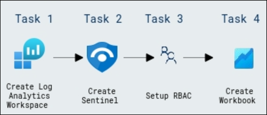


## Explanation of Components

The architecture for this lab involves the following key components:

   - **Log Analytics Workspace**: Centralized environment for collecting, storing, and analyzing logs from Azure resources.  

   - **Azure Sentinel**: Security analytics tool integrated with Log Analytics for real-time threat detection and response.  

   - **Role-Based Access Control (RBAC)**: Manages access securely by assigning roles to users and groups.  

   - **Workbooks**: Interactive dashboards for visualizing and analyzing data trends and security insights.

## Part 1: Design a solution 

In this task, you'll design a concept for monitoring and responding to security events with specific access permissions for Contoso's Security Operations Center.

### Design approach

The initial step involves analyzing the requirements based on the described scenario, understanding the objectives, and defining the requirements.

Based on the provided use case, the following requirements can be outlined:

- Deploy SIEM/SOAR Solution
- Limit access to specific SOC roles
- Create a dashboard with custom views for incidents and their alerts

In this scenario, you deploy the SIEM SOAR solution based on Microsoft Sentinel, set up role-based access control in the workspace context, and limit access for the network team to a single table in the log analytics workspace. Workbooks allow security analysts and administrators to visualize security data using graphical displays. They provide a tool for presenting and analyzing data in a dashboard.

### Proposed solution

| Requirement                                                         | Solution                                           | Action plan                                                          |
| ------------------------------------------------------------------- | -------------------------------------------------- | -------------------------------------------------------------------- |
| Deploy SIEM/SOAR Solution                                           | Microsoft Sentinel, Log Analytics Workspace        | Set up log analytics workspace and deploy Microsoft Sentinel         |
| Limit access to specific SOC roles                                  | Log Analytics Workspace, Role-based Access Control | Set up RBAC for Log Analytics Workspace                              |
| Create a dashboard with custom views for incidents and their alerts | Microsoft Sentinel, Workbook                       | Create a workbook with a custom view on current incidents and alerts |

## Part 2: Implement the solution 

### Task 1 - Create Log Analytics Workspace

In this task, you'll create a log analytics workspace which is required to house all of the data that Microsoft Sentinel will be ingesting and using for its detections and analytics.

1. Open Edge and sign into the Azure portal **`https://portal.azure.com`** using the following credentials:
   - **Username**: <inject key="AzureAdUserEmail"></inject>
   - **Password**: <inject key="AzureAdUserPassword"></inject>
     > **Note**: If you are asked to **Stay Signed in**, Click on **Yes**.
1. Search for **`log analytics workspace`**(1) and click on **log analytics workspace** (2).

   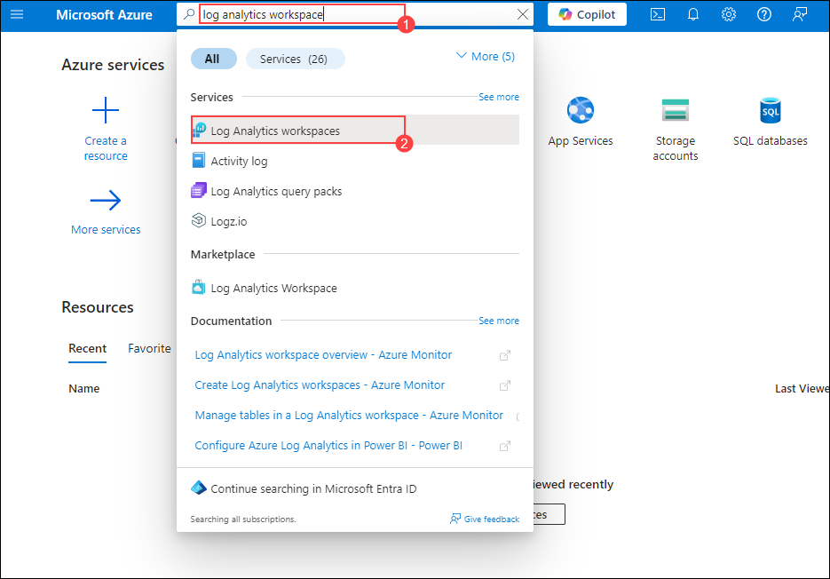

1. Click On **+ Create**.
1. On Create Log Analytics workspace tab, please enter the following details:
   | Settings | Values |
   | -- | -- |
   | Subscription | _Leave default subscription_ (1)|
   | Resource group | Select the resource group name **sc-100-lab1** from the dropdown list (2)|
   | Name | **law-sentinel-<inject key="DeploymentID" enableCopy="false" /></inject>** (3) |
   | Region | **<inject key="Resource group Region" enableCopy="false" ></inject>** (4) |

   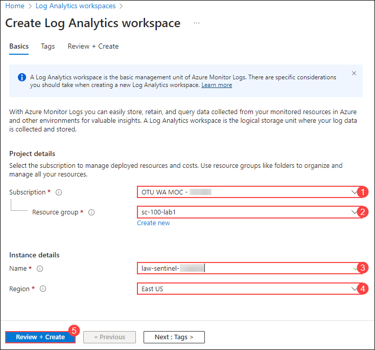

1. Select **Review & Create (5)**.
1. Select **Create** to start the deployment.

You successfully created the log analytics workspace for your Sentinel deployment.


> **Congratulations** on completing the task! Now, it's time to validate it. Here are the steps:
	
 - Hit the Validate button for the corresponding task. If you receive a success message, you can proceed to the next task.
 - If not, carefully read the error message and retry the step, following the instructions in the lab guide.
 - If you need any assistance, please contact us at labs-support@spektrasystems.com. We are available 24/7 to help you out.
    
<validation step="76fe2891-2386-4c8f-872c-46eb9701d50c" />

### Task 2 - Create Sentinel

In this task, you will add Sentinel to the created log analytics workspace and add demo logs, because the demo tenant doesn't have an existing data in the log analytics workspace, you import demo logs to have a better idea of how sentinel works.

1. In the search bar, in the blue banner at the top of the page, enter **`Microsoft Sentinel`** (1), then select it from the search results listed under services.

   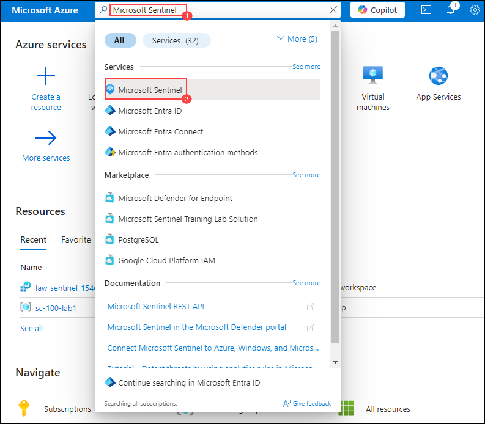

1. From the **Microsoft Sentinel** page, select **+ Create**.
1. In the **Add a Microsoft Sentinel to a workspace page** the previously created log analytics workspace should be listed. Select **law-sentinel-<inject key="DeploymentID" enableCopy="false" /></inject>** then select **Add**.
1. It may take a few minutes to add Sentinel to the workspace. Once it's added, the **Microsoft Sentinel | New & guides (1)** page is displayed. You're notified that the Microsoft Sentinel fre trial is activated. Select **Ok**.
1. From the center of the page, select **Go to content hub (2)**. Alternatively, from the left navigation panel expand **Content management** then select **Content hub**.

   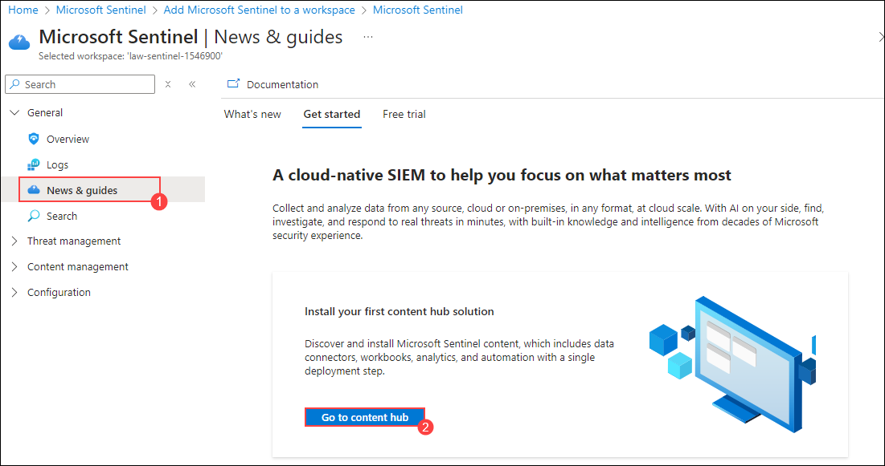

1. Search for **Microsoft Sentinel Training Lab (1)**, select it from the search results, and **install (2)** the solution.

   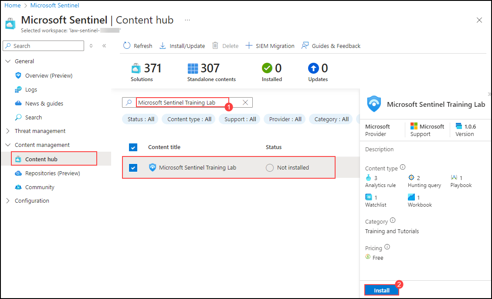

1. Select **Create (1)**.

   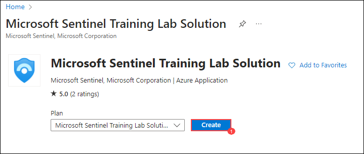

1. Choose the resource group **sc-100-lab1 (1)** and workspace **law-sentinel-<inject key="DeploymentID" enableCopy="false" /></inject> (2)**.
1. Select **Review & Create (3)** then select **Create**.

   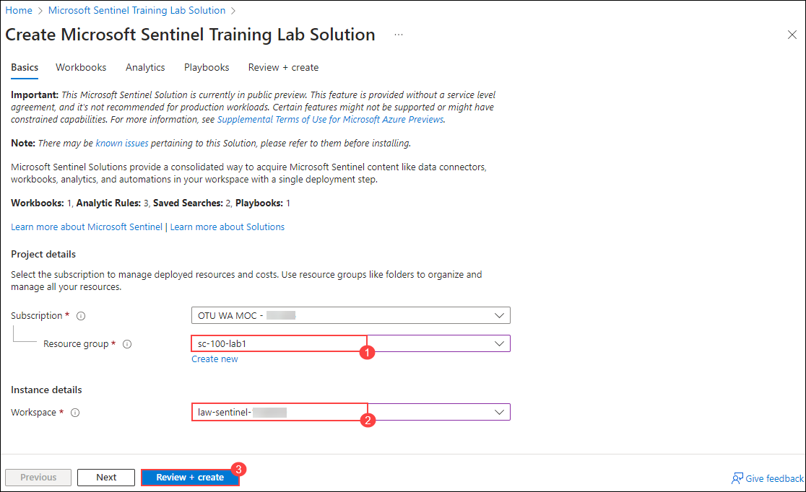

1. Wait till the solution is successfully installed.

You have successfully deployed Sentinel to the log analytics workspace and added data.

> **Congratulations** on completing the task! Now, it's time to validate it. Here are the steps:
	
 - Hit the Validate button for the corresponding task. If you receive a success message, you can proceed to the next task.
 - If not, carefully read the error message and retry the step, following the instructions in the lab guide.
 - If you need any assistance, please contact us at labs-support@spektrasystems.com. We are available 24/7 to help you out.
    
<validation step="dd739dbe-ab7d-4545-b085-2890cfd574ee" />

### Task 3 - Setup RBAC

In this task, you will design a security strategy for a hybrid environment using Microsoft solutions, focusing on Zero Trust, Identity & Access, Platform Protection, Data & AI Security, and GRC.

You will implement least privilege access by creating role assignments for the Security Operations Center (SOC) and Network Team, ensuring proper access control.

Additionally, you'll restrict the Network Team to only access Cisco Umbrella logs, enforcing strict access policies.

#### Permission requirements

| Role              | Permissions                                                             |
| ----------------- | ----------------------------------------------------------------------- |
| Security analyst  | View data, incidents, worksbooks and other Sentinel resources           |
|                   | Assigning/dismissing incidents.                                         |
| Security engineer | Create and edit workbooks and analytics rules                           |
|                   | Install and update solutions from content hub                           |
| Network Team      | Read Permissions for Group: **NOC** on Table: **Cisco_Umbrella_dns_CL** |

---

1. In the top searchbar, search for **Resoure groups** and select **sc-100-lab1** resource group.
1. In the left navigation pane, select **Access control (IAM) (1)**.
1. Select **Add (2)**, from the dropdown select **Add role assignment (3)**.

   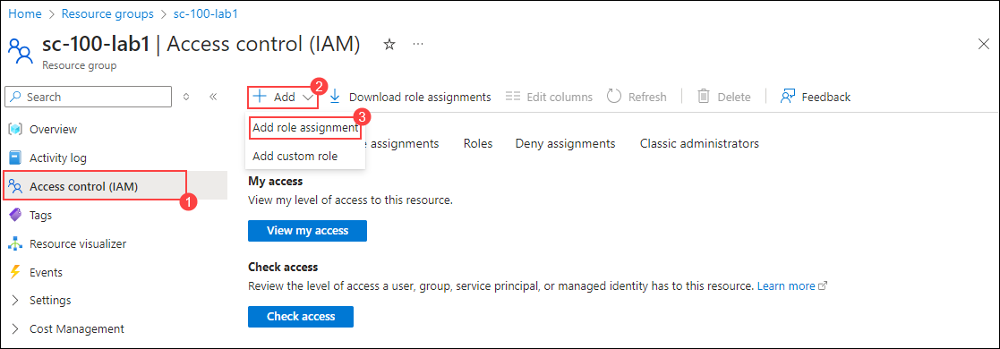

1. Search for **`Microsoft Sentinel Responder`** (1) and select **View** (2) in the Details column.
1. Review that the permissions match the requirements.
1. Close the window with **X** in the top right corner.
1. Select **Next (3)**.

   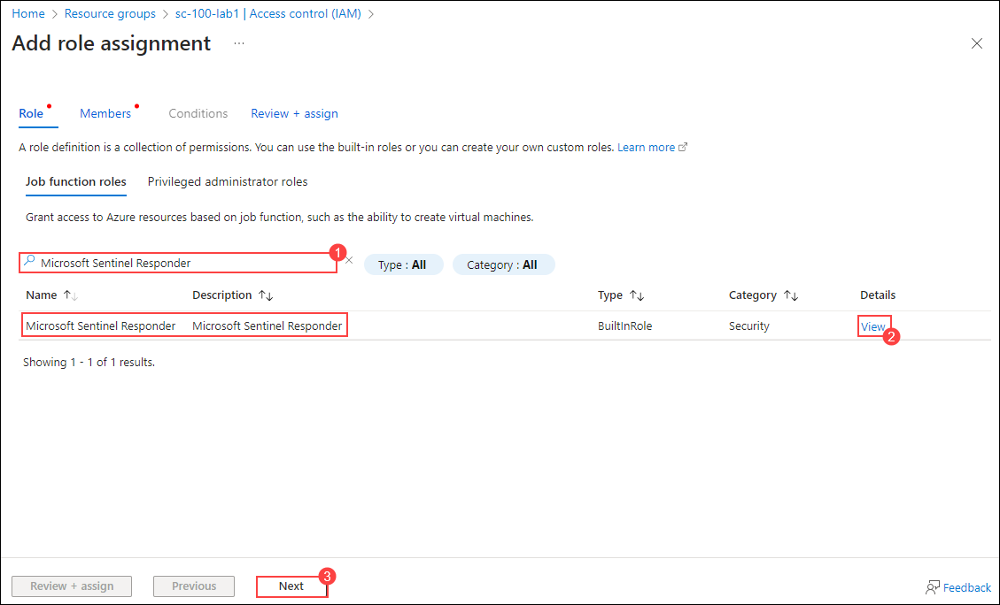

1. Select **+Select members (1)**.
1. Search for **`SOC Analysts`** (2) Group, select **SOC Analysts** from the search results, press **Select (3)** and add the role assignment.

   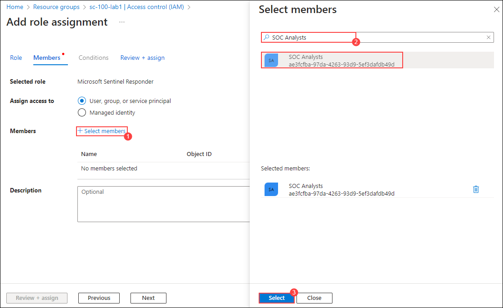

1. Select **Review + assign** twice.
1. You'll repeat the steps for the Sentinel Contributor role. Select **Add**, from the dropdown select **Add role assignment**.
1. Search for **`Microsoft Sentinel Contributor`** (1) and select the role (2).
1. Select **Next** (3).

   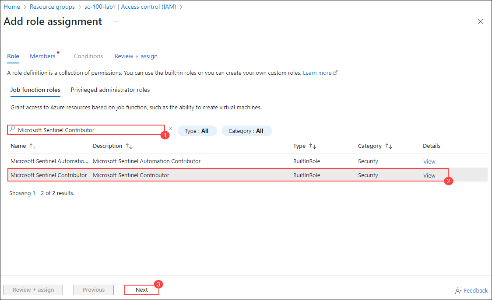

1. Select **+Select members (1)**.
1. On the **Select members** blade, search for the **`SOC Engineers`** (2) Group. From the search results select **SOC Engineers** press **Select (3)** to add the role assignment.

   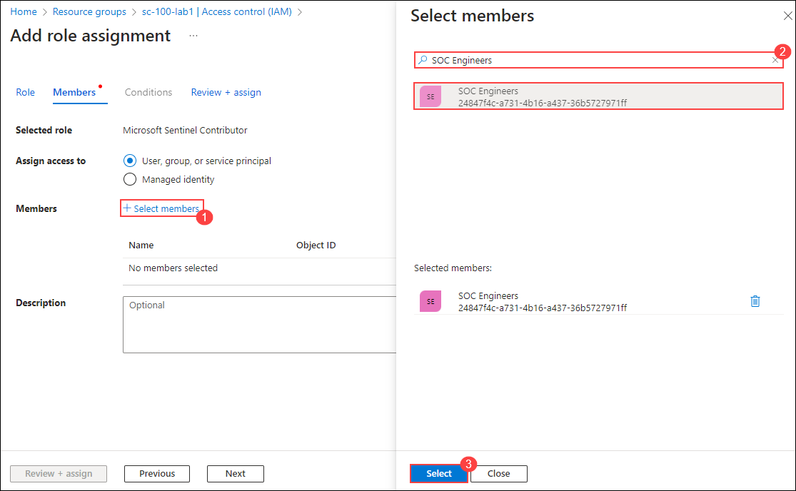

1. Select **Review + assign** twice.
1. Select **Role assignments tab**, Confirm that the role assignments are set.
1. Now you'll add a custom role. Select **Add** (1), from the dropdown select **Add custom role** (2).

   

1. Name it, **`NOC-CiscoUmbrellaCL-Read`** (1).
1. For **Baseline Permission**, select **Start from scratch** (2).
1. Select **Next** (3).

   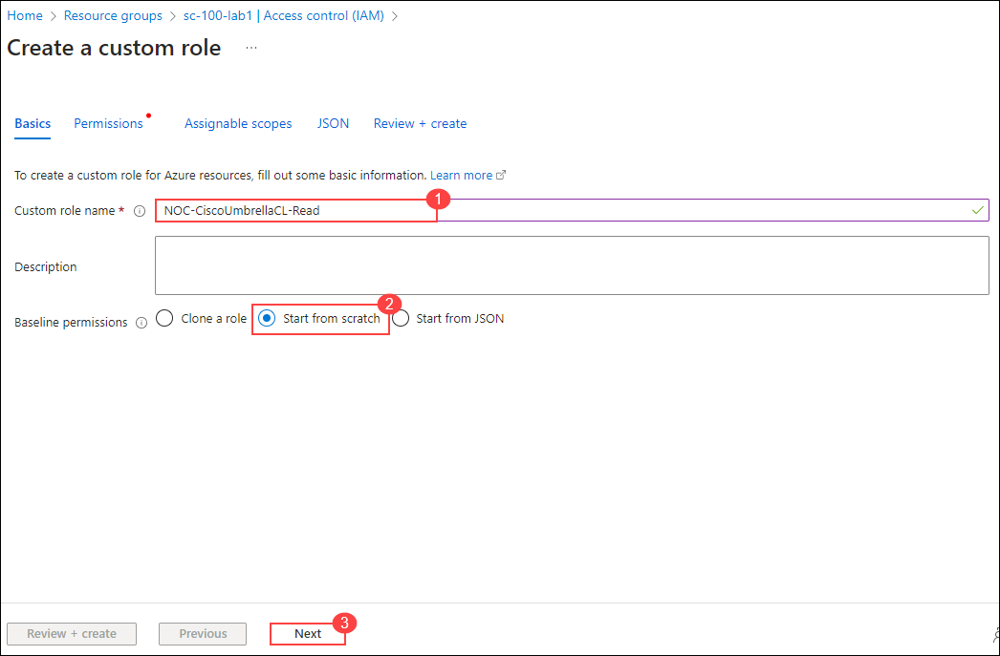

1. On the **Permissions** tab, select **Add permissions**.
1. Search for **`Microsoft.OperationalInsights`** (1), Select the **Azure Log Analytics** (2) card.

   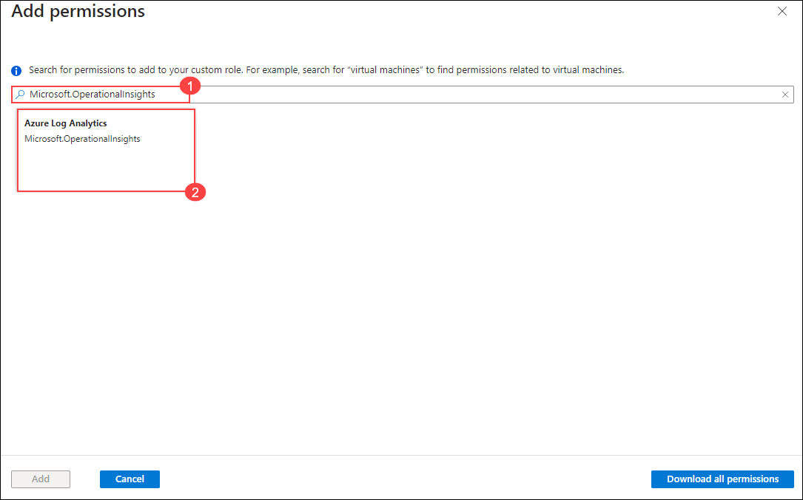

1. Add the following permissions.

   - Microsoft.OperationalInsights/workspaces (1)

     - Read : Get Workspace (2)
     - Other : Search Workspace Data (3)

       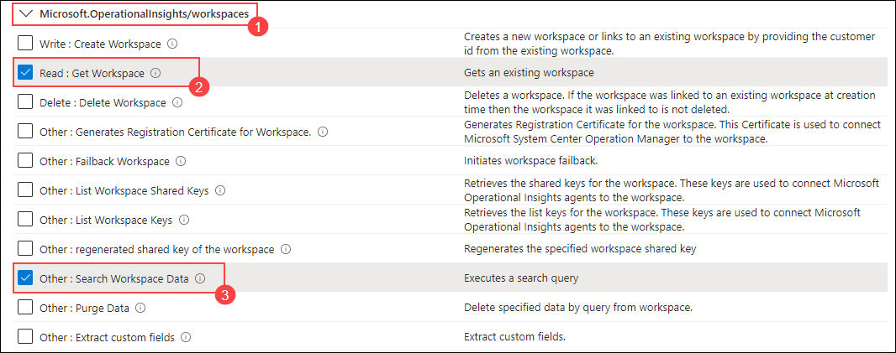

   - Microsoft.OperationalInsights/workspaces/analytics (1)

     - Other : Search (2)

       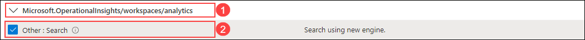

   - Microsoft.OperationalInsights/workspaces/query (1)

     - Read : Query Data in Workspace (2)

       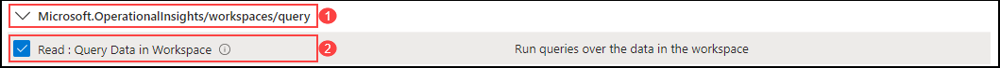

   - Microsoft.OperationalInsights/workspaces/tables/query (1)

     - Read : Query workspace table data (2)

       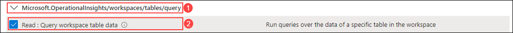

1. Click on **Add**.
1. Select **Review + Create**.
1. Select **Create**, then select **Ok**
1. In the top search bar, search for **`Resource groups`** and select **sc-100-lab1**.
1. Open the log analytics workspace **law-sentinel-<inject key="DeploymentID" enableCopy="false" /></inject>**.
1. In the left navigation pane, expand **Settings** (1) and select **Tables** (2).
1. Search for **`Cisco_Umbrella_dns_CL`** (3).
1. Click on the ellipses (...), select **Access control (IAM)** (4).

   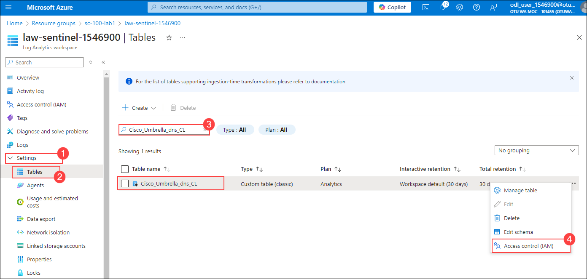

1. Select **Add** > **Add role assignment** (1).

   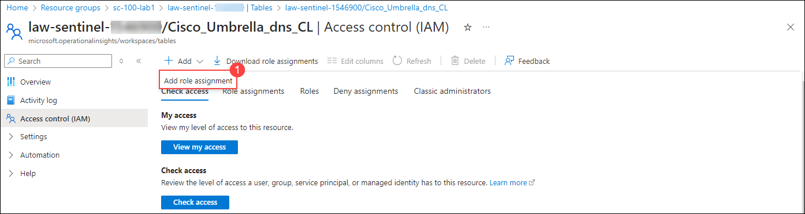

1. Search for **`NOC-CiscoUmbrellaCL-Read`** (1) and select the custom role (2).
1. Select **Next** (3).

   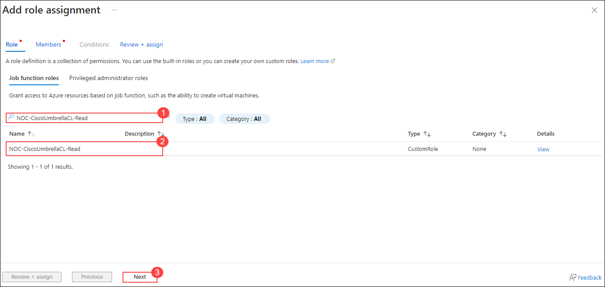

1. Select **Select Members** (1), search for **NOC** (2), select it from the search results then press **Select** (3).

   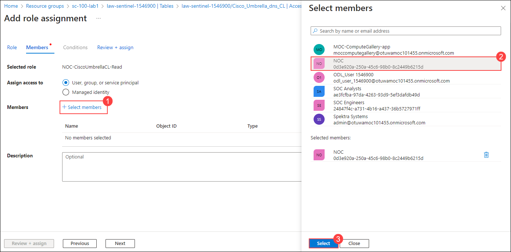

1. Select **Review + assign** twice.

You successfully created role based access model for the role requirements for Contoso´s security operations team and created a custom role for the network team and assigned the role on the specific table in your log analytics workspace.

> **Congratulations** on completing the task! Now, it's time to validate it. Here are the steps:
	
 - Hit the Validate button for the corresponding task. If you receive a success message, you can proceed to the next task.
 - If not, carefully read the error message and retry the step, following the instructions in the lab guide.
 - If you need any assistance, please contact us at labs-support@spektrasystems.com. We are available 24/7 to help you out.
    
<validation step="d2819e37-068f-437c-9026-013869aa3f4c" />

### Task 4 - Create Workbook

In this task, you´ll create a workbook, to get a dashboard with custom views and current incidents and their alerts.

1. On the Search bar on the top, search for **`Microsoft Sentinel`** and open it.

   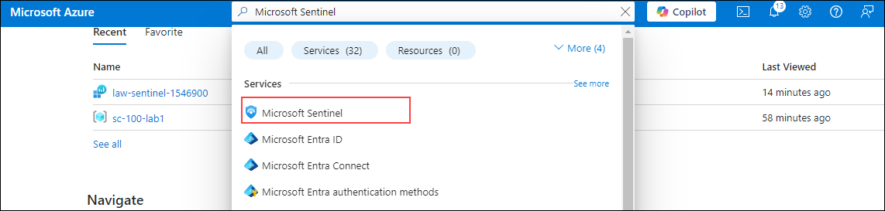

1. Select **law-sentinel-<inject key="DeploymentID" enableCopy="false" /></inject>**.
1. In the left navigation pane, expand **Threat management** (1) and select **Workbooks** (2).
1. Select **Add Workbook** (3).

   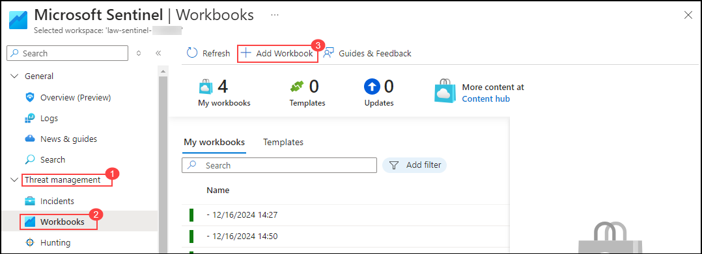

1. Select **Edit** (1).

   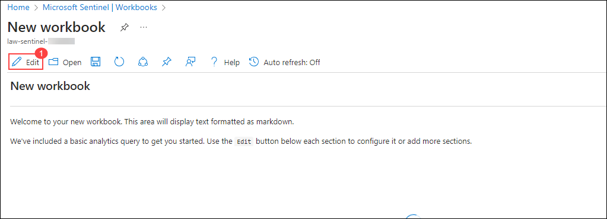
1. Select the first **Edit** button on the right side.

    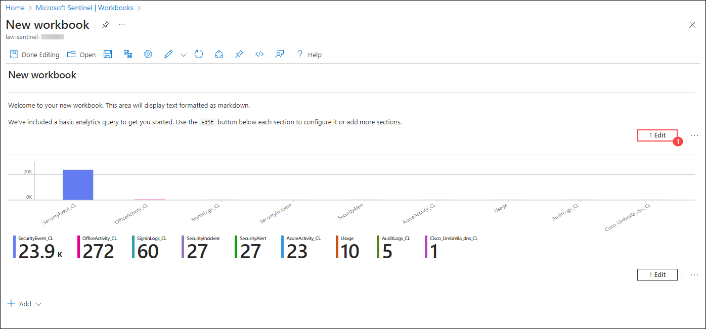
1. Select **Add** > **Add parameters**.

    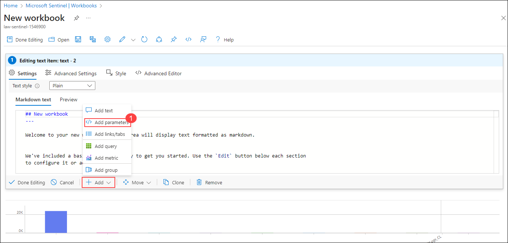
1. Select **Add parameter**.

    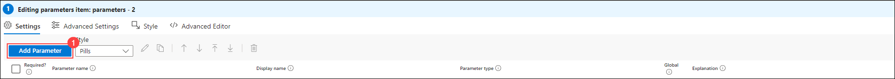
1. Fill out the following information:
   - **Parameter name:** TimeRange (1)
   - **Parameter type:** Time range picker (2)
1. Check the following settings:
   - **Required?** (3)
1. Select **Save** (4).

    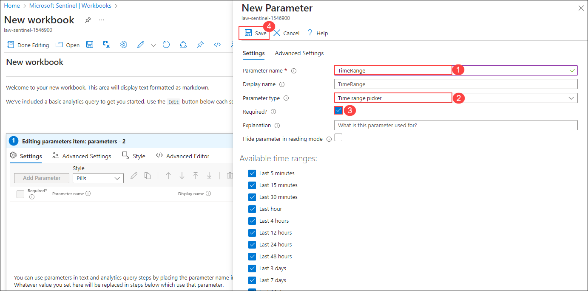
1. In the **TimeRange:** dropdown menu in the lower left, select **Last 7 days**.

    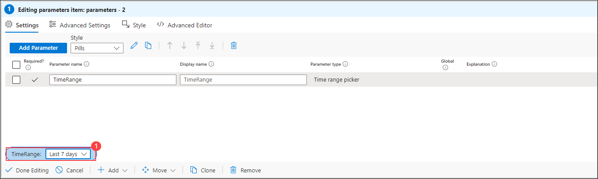
1. Select **Add parameter**.

    
1. Fill out the following information:
   - **Parameter name:** AlertSeverity (1)
   - **Parameter type:** Drop down (2)
1. Check the following settings:
   - **Required?** (3)
   - **Allow multiple selections** (4)
   - **Hide parameter in reading mode** (5)
1. Under **Log Analytics workspace Logs Query** paste in (6):

   ```KQL
   SecurityAlert
   | summarize Count = count() by AlertSeverity
   | order by Count desc, AlertSeverity
   | project Value = AlertSeverity, Label = strcat(AlertSeverity, ' - ', Count)
   ```

1. In the **Time Range** dropdown menu Select **TimeRange** (7).
1. Scroll down to **Include in the drop down**, check **All** and set **Default selected item** to **All**.

    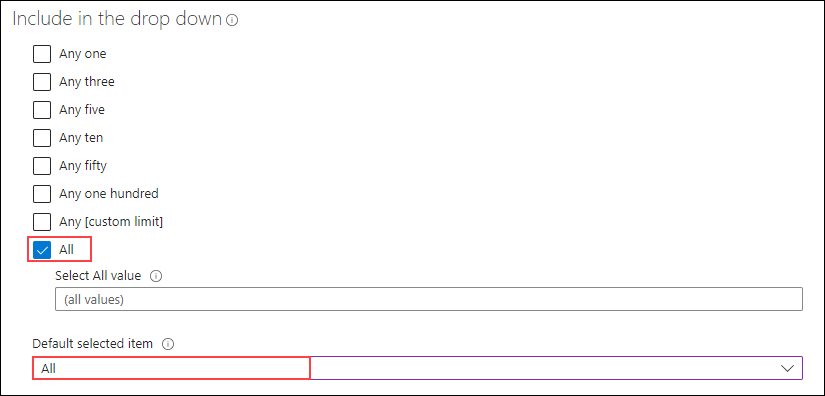
1. Select **Save** (8).

    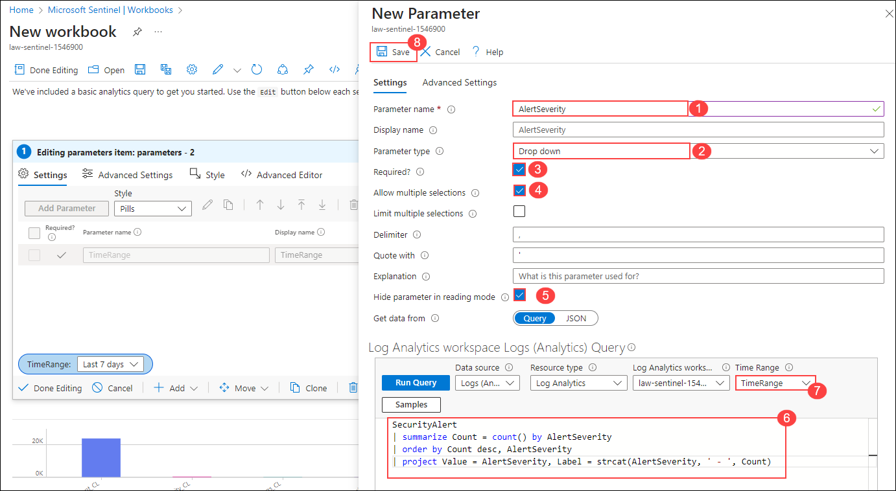
1. Select **Add parameter**. 

    
1. Fill out the following information:
   - **Parameter name:** ProductName
   - **Parameter type:** Drop down
1. Check the following settings:

   - **Required?**
   - **Allow multiple selections**
   - **Hide parameter in reading mode**

1. Under **Log Analytics workspace Logs Query** paste in:

   ```KQL
   SecurityAlert
   | summarize Count = count() by ProductName
   | order by Count desc, ProductName asc
   | project Value = ProductName, Label = strcat(ProductName, ' - ', Count)
   ```

1. In the **Time Range** dropdown menu Select **TimeRange**
1. Scroll down to **Include in the drop down**, check **All** and set **Default selected item** to **All**.

    
1. Select **Save**.
1. Select **Add** (1) and choose **Add query** (2).

    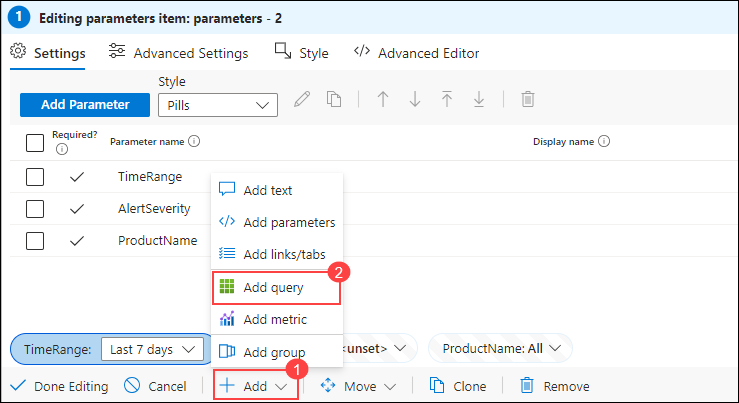
1. Under **Log Analytics workspace Logs Query** paste in (1):

   ```KQL
   SecurityIncident
   | where CreatedTime {TimeRange:value}
   | summarize arg_max(TimeGenerated,*) by tostring(IncidentNumber)
   | extend IncidentID = IncidentName
   | extend Alerts = extract("\\[(.*?)\\]", 1, tostring(AlertIds))
   | mv-expand AlertIds to typeof(string)
   | join
   (
       SecurityAlert
       | extend AlertEntities = parse_json(Entities)
       | mv-expand AlertEntities
   ) on $left.AlertIds == $right.SystemAlertId
   | summarize AlertCount=dcount(AlertIds) by IncidentNumber, Status, Severity, Title, Alerts, IncidentUrl, IncidentID
   | project IncidentNumber, IncidentID, Title, Severity, Status, AlertCount, Alerts, IncidentUrl
   | order by Severity
   ```

1. Choose **TimeRange** (2) in the Time Range drop down menu.You´ll setup dynamic content to get all alerts for the selected incident. Alerts will be exported and available outside this query.

    
1. Select the **Advanced Settings** (1) tab at the top of the **Editing query** window.
1. Check the following settings and select **Add Parameter** (3):
   - **When items are selected, export parameters** (2)

    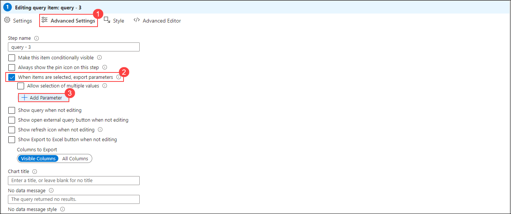
1. Fill in the following information:
   - **Field to export:** Alerts (1)
   - **Parameter name:** Alerts (2)
1. Select **Save** (3). 

    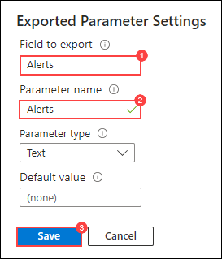
1. Go back to the **Settings** (1) tab.
1. Select **Run Query** (2).
1. Select **Column Settings** (3).

    
1. Select **IncidentUrl** (1).
1. Set Column renderer to **Link** (2).
1. Under Link Settings set **View to open** to **Url** (3).
1. Select **Save and Close** (4).

    
    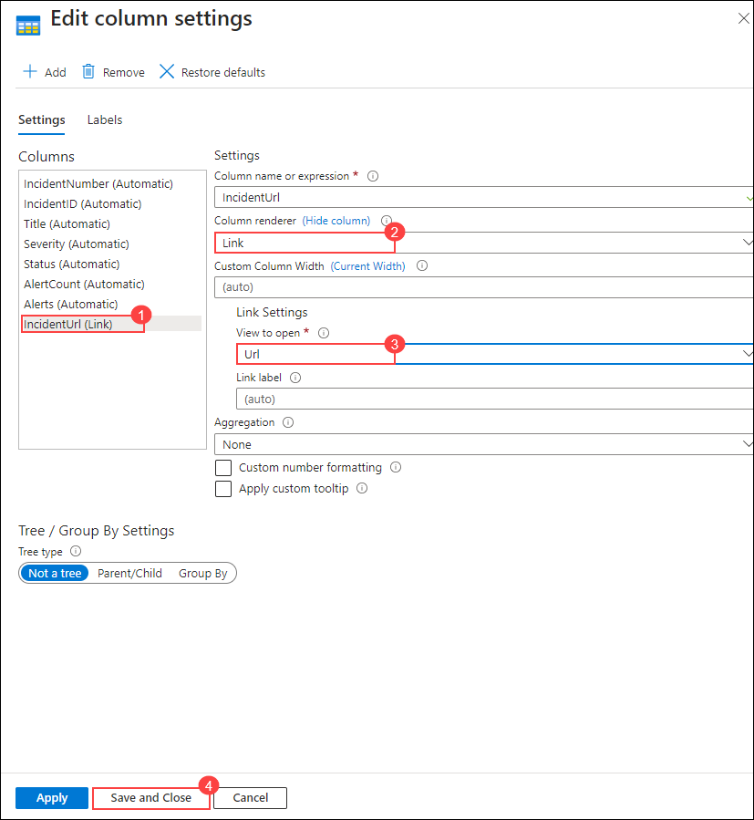
1. Next, You´ll create the alerts view based on which incident is selected.
1. Select **+ Add** (1) on the bottom of the **Editing query item** window. Select **Add query** (2).

    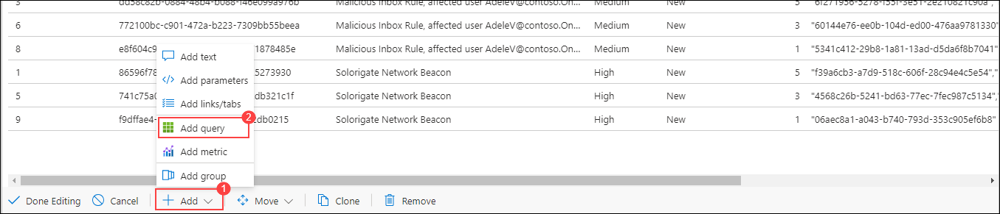
1. Paste the KQL in the Log Analytics workspace Logs Query (1):

   ```KQL
   SecurityAlert
   | where SystemAlertId in ({Alerts})
   | summarize by  DisplayName, StartTime, EndTime,  SystemAlertId
   | sort by EndTime desc
   ```

1. Choose **TimeRange** (2) in the Time Range drop down.
1. Select **Done Editing** (3) in the top bar of the **New workbook** window.

    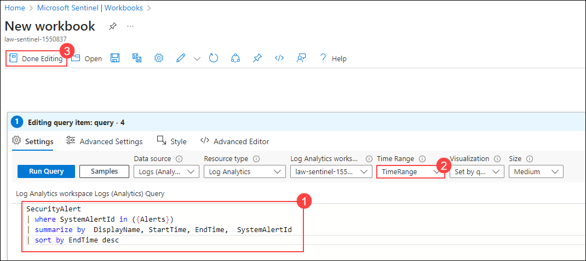
1. Select an **Incident**.
1. Alerts to the linked Incident will show up below.
1. Save your query by selecting the Save icon.
1. In the **Save as** window, enter a title for your new workbook (1), select the **sc-100-lab1** (2) resource group from the drop-down, then select **Save as** (3).

    

You successfully created a dashboard with custom views for incidents and the associated alerts.

> **Congratulations** on completing the task! Now, it's time to validate it. Here are the steps:
	
 - Hit the Validate button for the corresponding task. If you receive a success message, you can proceed to the next task.
 - If not, carefully read the error message and retry the step, following the instructions in the lab guide.
 - If you need any assistance, please contact us at labs-support@spektrasystems.com. We are available 24/7 to help you out.
    
<validation step="80e42d63-07d4-44b8-bce9-022ddf79ca4d" />

### Review
In this lab, you have completed the following:
- Created the log analytics workspace for your Sentinel deployment.
- Deployed Sentinel to the log analytics workspace and added data.
- Created role based access model for the role requirements for Contoso´s security operations team.
- Created a dashboard with custom views for incidents and the associated alerts.

### You have successfully finished the exercise. Click on **Next** to move on to the next one.
