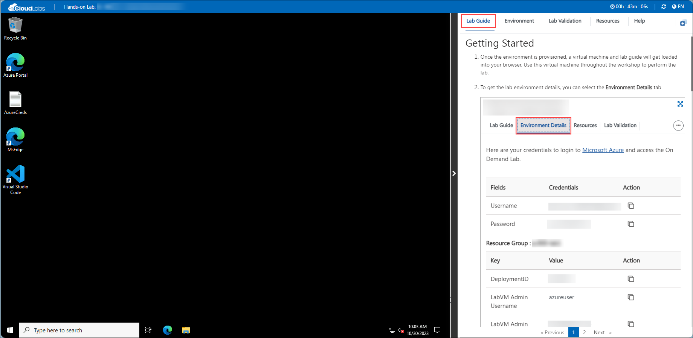
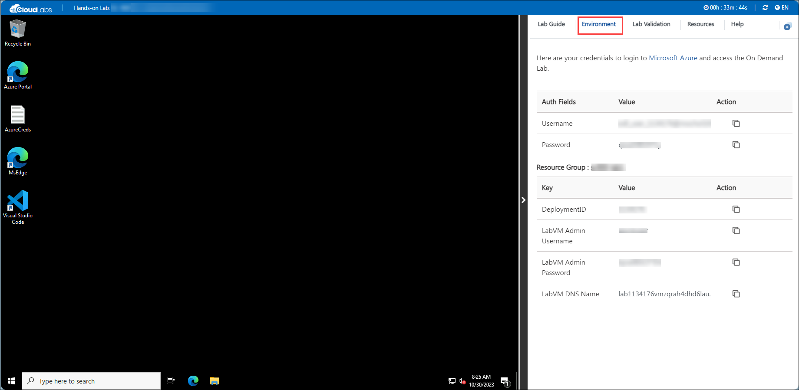
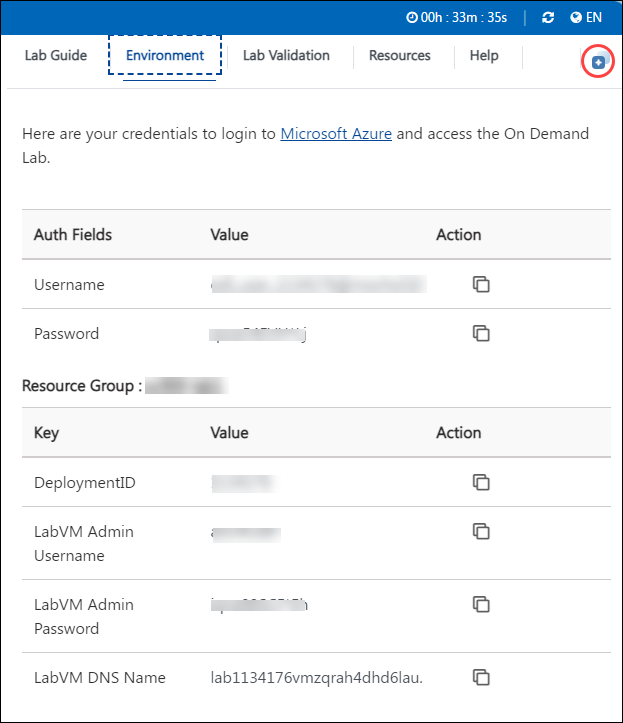
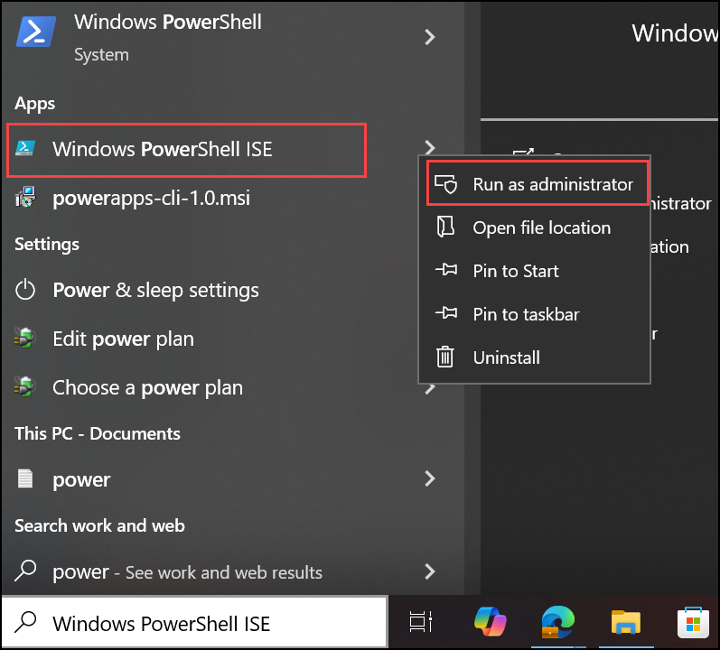

# Getting Started with your SC-100: Microsoft Cybersecurity Architect Lab

Welcome to your SC-100: Microsoft Cybersecurity Architect workshop! This environment has been designed to guide you through the essential skills needed to become a proficient Microsoft Cybersecurity Architect, equipping you with the knowledge to design, implement, and manage security solutions that align with Zero Trust principles and best practices. Let's begin by making the most of this experience:

## Accessing Your Lab Environment

Once you're ready to dive in, your virtual machine and lab guide will be right at your fingertips within your web browser.



## Virtual Machine & Lab Guide

Your virtual machine is your workhorse throughout the workshop. The lab guide is your roadmap to success.

## Exploring Your Lab Resources

To get a better understanding of your lab resources and credentials, navigate to the **Environment** tab.



## Utilizing the Split Window Feature

For convenience, you can open the lab guide in a separate window by selecting the **Split Window** button from the Top right corner.



## Managing Your Virtual Machine

Feel free to start, stop, or restart your virtual machine as needed from the **Resources** tab. Your experience is in your hands!


## Lab Duration Extension

1. To extend the duration of the lab, kindly click the **Hourglass** icon in the top right corner of the lab environment.

   

   > **Note:** You will get the **Hourglass** icon when 10 minutes are remaining in the lab.

2. Click **OK** to extend your lab duration.

   

3. If you have not extended the duration prior to when the lab is about to end, a pop-up will appear, giving you the option to extend. Click **OK** to proceed.

## Let's Get Started with Azure Portal

1. On your virtual machine, click on the Azure Portal icon as shown below:

   .png>)

1. You'll see the **Sign into Microsoft Azure** tab. Here, enter your credentials:

   - **Email/Username:** <inject key="AzureAdUserEmail"></inject>

     

1. Next, provide your password:

   - **Password:** <inject key="AzureAdUserPassword"></inject>

     

1. If **Action required** pop-up window appears, click on **Ask Later**.

1. If prompted to stay signed in, you can click **"No"**.

1. If a **Welcome to Microsoft Azure** pop-up window appears, simply click **"Cancel"** to skip the tour.

1. You can use the **Previous(1)** and **Next(2)** buttons to navigate through the lab guide.

   -1.png>)

1. In the search bar, search for **Windows PowerShell ISE**, then right-click on it and select **Run as administrator**.

   

1. Execute the following commands in PowerShell to install the Teams module and create teams and channels, which will be utilized in later labs.

   ```
   Install-Module -Name PowerShellGet -Force -SkipPublisherCheck
   Install-Module -Name MicrosoftTeams -Force

   ```
1. Run the following command Authenticate with your Microsoft account:

   ```
   Connect-MicrosoftTeams
   ```

   - **Email/Username:** <inject key="AzureAdUserEmail"></inject>

   - **Password:** <inject key="AzureAdUserPassword"></inject>

1. Execute the following command to create a new team in Microsoft Teams named **Team for Mark 8 Project**.

   ```
   $team = New-Team -DisplayName "Mark 8 Project Team" -Description "Team for Mark 8 Project" -Visibility Private
   ```
1. Execute the following command to create a new
   Channel in Microsoft Teams named **Research and Development**

   ```
   New-TeamChannel -GroupId $team.GroupId -DisplayName "Research and Development"
   ```
1. Run the following command to add the new members, **Joni Sherman** and **Adele Vance**, to the team, which will be used in subsequent labs.

   ```
   $teamId = (Get-Team | Where-Object { $_.DisplayName -eq "Mark 8 Project Team" }).GroupId

   Add-TeamUser -GroupId $teamId -User "john.sherman@microsoft
   .com"

   Add-TeamUser -GroupId $teamId -User "adelev.@microsoft.com"
   ```

## Support Contact

The CloudLabs support team is available 24/7, 365 days a year, via email and live chat to ensure seamless assistance at any time. We offer dedicated support channels tailored specifically for both learners and instructors, ensuring that all your needs are promptly and efficiently addressed.

Learner Support Contacts:

- Email Support: labs-support@spektrasystems.com
- Live Chat Support: https://cloudlabs.ai/labs-support

## Happy Learning!!
